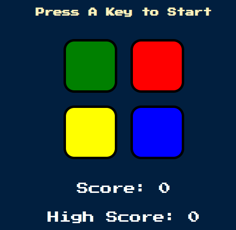

### Versão em Portugês 
# Simon Game

Jogo para testar a memória, onde o usuário precisa repetir a sequência de cores e sons apresentada. A cada rodada, a dificuldade aumenta com a adição de um novo passo na sequência.

### Preview
 

## Tecnologias usadas
- **HTML**
- **CSS**
- **JavaScript**

## Aprendizados
Esse projeto me ajudou a:
- Entender melhor o uso de **async** e **setTimeout**
- Praticar a adição de eventos em botões
- Aprimorar minha **lógica de programação**

## Como jogar
1. Aperte a tecla **A** para iniciar.
2. O jogo vai exibir uma sequência de cores com sons.
3. Clique nas cores na mesma ordem em que foram mostradas.
4. A cada acerto, a sequência fica maior.
5. Ao errar deve se clicar em qualquer tecla para o jogo reiniciar.

## Objetivo
Tente acertar a maior sequência possível sem errar!

## Link para jogar
👉 [Clique aqui para jogar](https://josuekla.github.io/Project-Simon-Game-Challenge/)

___

### English Version
# Simon Game

Game to test memory, where the user needs to repeat the sequence of colors and sounds presented. With each round, the difficulty increases with the addition of a new step in the sequence.

### Preview
 

## Technologies used
- **HTML**
- **CSS**
- **JavaScript**

## Learnings
This project helped me to:
- Better understand the use of **async** and **setTimeout**
- Practice adding events to buttons
- Improve my **programming logic**

## How to play
1. Press the **A** key to start.
2. The game will display a sequence of colors with children.
3. Click on the colors in the same order they were shown.
4. With each correct answer, the sequence becomes longer.
5. If you make a mistake, you must press any key for the game to restart.

## Objective
Try to get the longest sequence possible without making a mistake!

## Link to play
👉 [Click here to play](https://josuekla.github.io/Project-Simon-Game-Challenge/)
